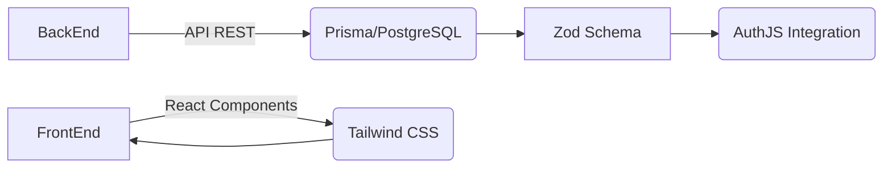

# **Statement of Work (SOW) - BarberApp**

---

## 1. Introducción y alcance del proyecto  
BarberApp es una aplicación web completa para gestionar citas en barberías, que permitirá a los clientes agendar, modificar y cancelar citas con diferentes barberos mientras proporciona al personal administrativo herramientas avanzadas de gestión.

---

## 2. Objetivos del proyecto  
### **Generales:**  
- Desarrollar una aplicación web integrada para gestionar citas en barberías  
- Crear un sistema completo de autenticación/autorización con roles  

### **Específicos:**  
```gantt
#### Cliente/Usuario:
1. Diseño frontend intuitivo para agendamiento de citas
2. Implementación de calendario interactivo mostrando disponibilidad horaria
3. Sistema de notificaciones por email

#### Administrador:  
4. Panel completo de gestión con CRUD para usuarios/barberos/citas
5. Dashboard con estadísticas y reportes
6. Configuración del sistema (horarios, servicios)
```

---

## 3. Requisitos funcionales  
```javascript /node_modules/zod/src/index.ts  
const BarberAppSchema = z.object({
  authentication: z.boolean().describe("Sistema de autenticación con roles"),
  appointmentManagement: z.boolean().describe("CRUD completo para citas"),
  notificationSystem: z.boolean().and([
    z.object({email: true}).describe("Notificaciones por correo"),
    z.object({realTime: true}).describe("Notificaciones en tiempo real")
  ])
})
```

---

## 4. Requisitos no funcionales  
### **Performance:**  
- <T> ≤ 200ms para todas las operaciones CRUD principales  
- Capacidad de escalar hasta 500 usuarios simultáneos  

### **Compliance:**  
```typescript /prisma/schema.prisma  
model BarberApp {
  id:        String   @id @default(auto())
  name:      String
  email:     String    // Validación RFC para correos
  role:      Role      // Enum('ADMIN','BARBER','CUSTOMER')
  createdAt: DateTime  @updatedAt 
}

enum Role { ADMIN, CUSTOMER, BARBER }
```

---

## 5. Metodología de desarrollo  
### **Enfoque GitHub Projects:**  


---

## 6. Entregables del proyecto  
1. **Documentación:**  
   - Esquema Prisma detallado  
   - Colección de wireframes y prototipos UX/UI  

2. **Implementación:**  
   ```bash /deployment-steps.txt  
   # Pasos de despliegue  
   1. Configurar entorno backend con Docker Compose  
   2. Implementar frontend en Next.js  
   3. Integrar AuthJS para autenticación segura  
   ```

---

## 7. Stack tecnológico  
```bash /tech-stack.json  
{  
  "backend": ["Node.js", "Express", "Prisma", "PostgreSQL"],  
  "frontend": ["Next.js", "React", "TypeScript", "Tailwind CSS"]  
}
```

---

## 8. Plan de proyecto y cronograma  
```gantt  
BarberApp | subsections  
section1: Análisis Requerimientos (2 semanas)  
section2: Diseño Backend/Schema Prisma (3 semanas)  
section3: Frontend Development (6 semanas)  
```

---

## 9. Estructura del equipo  
### **Roles:**  
- Product Owner: Gestión de requerimientos y stakeholders  
- Scrum Master: Supervisión constante del desarrollo  

---

## 10. Presupuesto estimado  
```excel /budget.xlsx  
backendHours = 250; backendCost = $45,000  
frontendHours = 300; frontendCost = $48,000  
totalEstimated = $93,000
```

---

## 11. Gestión de riesgos y contingencias  
### **Principales:**  
```typescript /risk-management.ts  
const risks = [  
  { id: 'sql_injection', description: 'Vulnerabilidad en consultas Prisma' },  
  { mitigation: ['Parametrizar todas las queries'], impact: 'alto' }  
] as const;
```

---

## 12. Criterios de aceptación  
### **Especificados:**  
```bash /acceptance-criteria.sh  
# Casos de prueba  
testLogin() { echo "Validar roles en login"; return 0 }
testBookAppointment() { echo "Probar flujo completo de agendamiento"; return 0 }
```
```markdown
[Todos los entregables]  
✅ Requerimientos funcionales implementados  
✅ Cobertura de pruebas >85%  
✅ Documentación verificada y completa